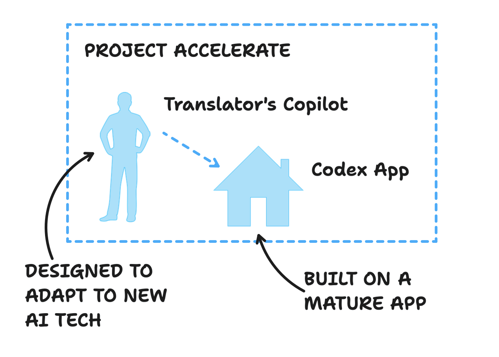

# What is Project Accelerate?

Welcome to Project Accelerate, where we are dedicated to advancing the field of Bible translation through the development of innovative tools and technologies. Our primary focus is on user-focused development, ensuring that we meet the needs of translators around the globe.

Our teams are excited to make this vision a reality. Joel and the Scribe team, alongside Birch and UnfoldingWord, are creating the base Codex app and adding rendered components as plugins. Meanwhile, Ryder and his team are developing AI functionality, chat interfaces, and orchestrating copilot behavior and information management in the translation app.

We are proud to have the support and collaboration of esteemed organizations such as BCS, UnfoldingWord, Biblica, SIL, and the ETEN Innovation Lab. Together, we have formed a [steering committee](project-overview/steering-committee.md) that ensures this project moves forward quickly, effectively, and collaboratively.

Join us on this incredible journey as we harness the power of AI and provide translators with the tools they need to excel. Project Accelerate is ready to innovate today, and we invite you to be a part of this open-source collaborative project.

In Project Accelerate, several implementing partners are working together to develop assisted translation tools rapidly. A key component is the Translator's Copilot, which will be a part of Codex—the forked VS Code app that will incorporate features from the Open Components Ecosystem. While SIL will host the shared library and implement the functions in ScriptureForge, the rest of the team will do so in Scribe V2.

<figure><figcaption>
Project Accelerate: building the Translator's Copilot in the Codex App
</figcaption></figure>

### Development Priorities

View our current [roadmap.md](project-overview/roadmap.md "mention") (subject to change!).
